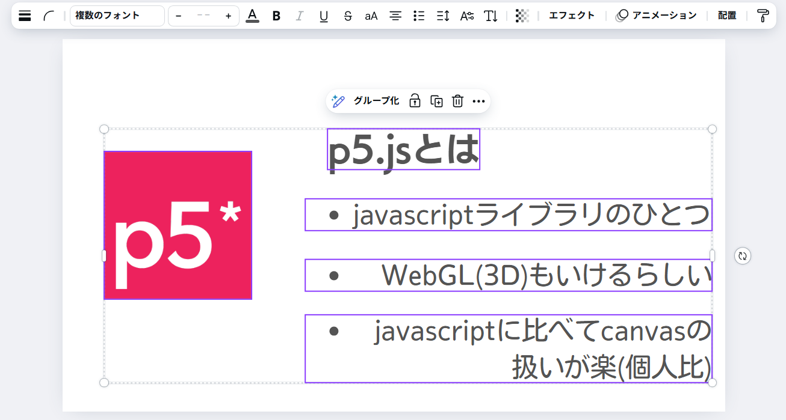

<h2>素早いスライド作りに役立つ技術</h2>

  
25/06/22 @自学発表サークル 
  kumori 情報コース

 ---
 <!-- header:  素早いスライド作りに役立つ技術-->
<!--
_class:
 - lead
-->

### 楽に早くスライド作りたいなあ…

---

#### 自分がこれまでに使ってきたスライド作成サービス
- Googleスライド
- Canva
- PowerPoint

-> これらに共通すること

---
<!--
_class:
 - lead
-->
## レイアウトに時間を割きがち
---

---
## 効率的なスライド作り
- 限られた時間でどこまで作れるか
- 見やすければ美しさは妥協
---
# MARP
- マークダウンでスライドを作成
- Gitで管理できるのでホスティングとファイル管理がスムーズに
    - スライドを自分でホストできると嬉しい

-> キーボードだけでスライドが作れる(!)
---

